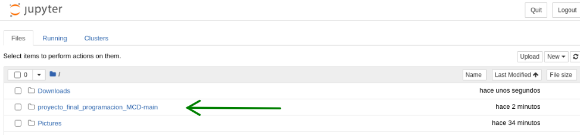
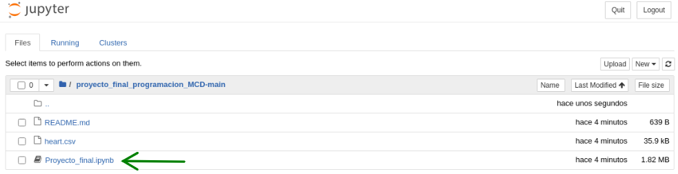

# Proyecto Final de Programación en Python de la MCD 

## Predicción de Insuficiencia Cardiaca en pacientes

Las enfermedades cardiovasculares (ECV) son la principal causa de muerte a nivel mundial cobrando un estimado de 17,9 millones de vidas cada año, lo que representa el 31% de todas las muertes en todo el mundo. Cuatro de cada 5 muertes por ECV se deben a ataques cardiacos y accidentes cerebrovasculares, y un tercio de estas muertes ocurren prematuramente en personas menores de 70 años. La insuficiencia cardiaca es un evento común causado por las ECV y este conjunto de datos contiene 11 características que pueden usarse para predecir una posible enfermedad cardiaca.

Las personas con enfermedad cardiovascular o que se encuentran en alto riesgo cardiovascular (debido a la presencia de uno o más factores de riesgo como hipertensión, diabetes, hiperlipidemia o enfermedad ya establecida) necesitan una detección y manejo precoces donde un modelo de aprendizaje automático puede ser de gran ayuda.

Los datos se obtuvieron a partir de la plataforma de Kaggle: [Heart Failure Prediction](https://www.kaggle.com/fedesoriano/heart-failure-prediction). La descripción de los datos se encuentran dentro del notebook.

## Reproducibilidad y Manipulación del Notebook

Para la reproducibilidad y manipulación del código presentado en el notebook de Jupyter se puede utilizar Anaconda o algún otro software libre que disponga de Python así como también se puede utilizar alguna plataforma online como Google Colab. 

Requerimientos para acceder al notebook desde Anaconda:
1. Descargar el repositorio de GitHub
2. Acceder a Anaconda
3. Hacer click en Launch de Jupyter 
 
 
4. Buscar la **carpeta proyecto_final_programacion_MCD** en la pestaña de 'Files' en Jupyter.
 
5. Dar click al notebook **Proyecto_final.ipynb**
 

Y todo listo para comenzar!

Si se tiene cualquier otra duda acerca de cómo leer el notebook da click [aquí](https://data36.com/how-to-use-jupyter-notebook-basics-for-beginners/).
